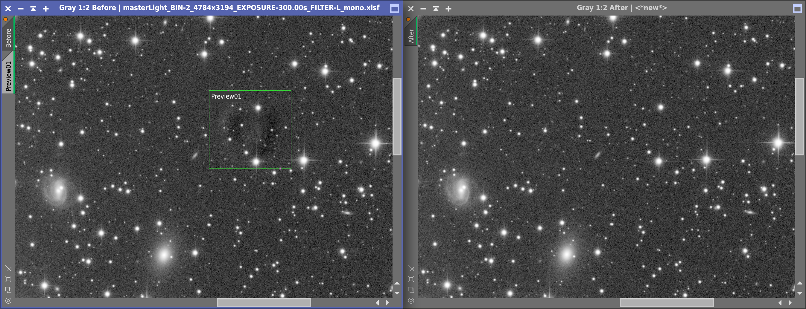
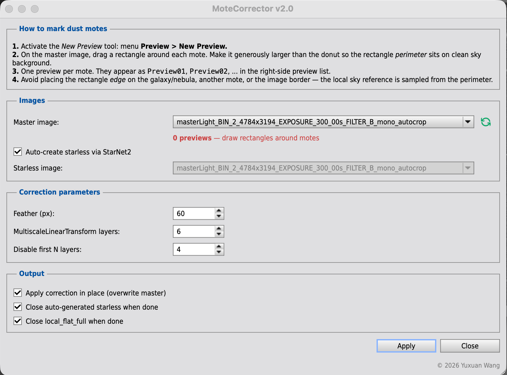

# MoteCorrector

Dust particles fell on the sensor window or moved during imaging sessions?  This is a PixInsight script for removing **flat-calibration dust motes** from a stacked
master image, after the fact, without re-shooting flats.

If your master light shows or circle-shaped or donut-shaped shadows that calibration didn't
clean up, MoteCorrector lets you draw a rectangle around each mote and divides
out a locally-anchored local flat. The correction is feathered into the
surrounding sky so it leaves no visible seam.

### Before / after

### The dialog

---

## Installation

1. Download `MoteCorrector.js` from this repository.
2. In PixInsight: `Script → Feature Scripts… → Add` and select the folder
   containing `MoteCorrector.js`.
3. The script appears under `Script → Utilities → MoteCorrector`.

Alternatively, copy `MoteCorrector.js` into your PixInsight scripts directory
(e.g. `<PI install>/src/scripts/`) and restart PixInsight.

---

## How it works

### The intuition

**The problem.** Dust on your filters or sensor leaves soft dark donuts in the
stacked image. Flat-field calibration is supposed to erase them, but if a
speck moved between when you took flats and when you took lights, or your
flats are stale, leftover donuts survive into the final master.

**The fix in one sentence.** If you take the stacked master, remove the stars,
and blur the fine detail away, what's left is a smooth portrait of the
*illumination* — the same thing a flat-frame is supposed to record. Divide
that smoothed version into the master, and the donuts vanish.

**Why only inside rectangles?** A galaxy's outer halo or a faint nebula are
also low-frequency structure in the smoothed image. If the script divided
globally, it would erase real signal. By restricting the correction to a
small rectangle around each donut — with a feathered edge that fades smoothly
to zero — the rest of your image is left completely untouched.

**Why sample the local sky?** The smoothed master still carries a sky
gradient. Normalizing to a global median would brighten or darken the wrong
amount in different parts of the frame. Instead, MoteCorrector reads the sky
level along the *perimeter* of each rectangle — clean sky right next to the
donut — and uses that as the local truth, so the patched region blends
seamlessly with the surrounding sky.

**What you do.** Draw a box around each donut. Click Apply. Done.

### Under the hood

1. Generate (or supply) a **starless** copy of the master.
2. Run `MultiscaleLinearTransform` on the starless with the first *N* detail
   layers disabled. This kills stars and small structure and keeps the
   low-frequency illumination — your local flat (`local_flat_full`).
3. For each user-drawn preview, sample the local sky from `local_flat_full` along
   the rectangle's **perimeter** (not the global median). This anchors each
   correction to the local sky level near the mote.
4. Apply the per-mote correction in PixelMath under a cosine-feathered mask:

   $$\text{out} = \text{master}\cdot
   \left(1 + m\cdot\left(\frac{B}{\text{local\ flat}} - 1\right)\right)$$

   where $m \in [0,1]$ is the feathered preview mask and $B$ is the local sky
   reference for that preview. Overlapping previews are weighted-averaged
   automatically.

The math is equivalent to a hand-crafted "flat retouch" PixelMath workflow,
just localized and automated across many motes at once.

---

## Requirements

- **PixInsight 1.8.9** or later.
- **StarNet2** module — only required if you let MoteCorrector generate the
  starless image automatically. You can also supply your own starless and
  uncheck "Auto-create starless via StarNet2".

---

## Usage

1. Open your stacked master in PixInsight.
2. Activate the New Preview tool: **Preview → New Preview**.
3. Drag a rectangle around each dust mote. The rectangle should be **larger
   than the donut**, with its perimeter on clean sky background.
   - Avoid placing the rectangle edge on the galaxy/nebula, another mote, or
     the image border.
4. Run `Script → Utilities → MoteCorrector`.
5. Select the master image. The script counts your previews and warns if
   none are drawn.
6. Click **Apply**. Iterate parameters and apply again as needed.

### Parameters

| Parameter | Default | Notes |
|---|---|---|
| Feather (px) | 60 | Half-width of the cosine-feather around each preview rectangle. Larger = softer blend, less localized. |
| MultiscaleLinearTransform layers | 6 | Total wavelet layers. Higher captures larger-scale structure in the local flat. |
| Disable first N layers | 4 | Number of fine-detail layers to disable. Higher = smoother local flat. |
| Apply correction in place | on | If off, creates a new image `<master>_corrected`. |
| Close auto-generated starless | on | Cleanup intermediate when done. |
| Close local_flat_full | on | Cleanup intermediate when done. |

### Tips

- The default feather (60 px) and layer settings work for most CDK / RASA-class
  images at native resolution. If your image is heavily binned, drop both.
- One preview per mote. Overlapping previews are blended automatically — fine
  for motes that touch.
- If a mote sits partially off-image or against a bright object, the
  perimeter-based local-sky estimate will degrade gracefully (sampled from
  whatever sides are valid). The console reports `[N/4 sides in-bounds]` for
  diagnostic.

---

## Why not DBE / GraXpert / CloneStamp?

- **DBE / ABE / GraXpert** target large-scale gradients. They will pull
  localized donuts inconsistently, often leaving a halo or shifting global
  brightness.
- **CloneStamp** works for one or two motes but is tedious for a dozen and
  doesn't preserve the underlying sky structure.
- **MoteCorrector** is targeted: rectangle in, donut gone, no global side effects.

---

## License

[MIT](LICENSE) © 2026 Yuxuan Wang.

---

## Changelog

### v2.0
- Local-sky reference sampled from each preview's perimeter (replaces global
  median); correction stays accurate under gradients.
- Auto-generated starless via StarNet2 (optional).
- In-place correction option.
- Spinbox tooltips and dialog spacing improvements.

### v1.0
- Initial release.
